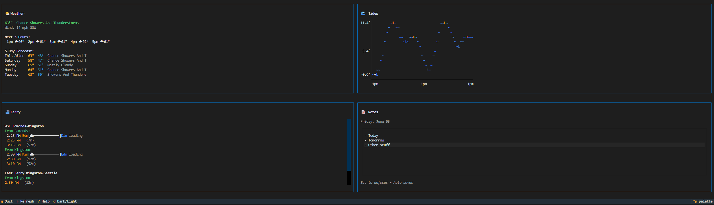

# TUIDash

A daily dashboard TUI application showing weather, tides, ferry times, and notes.



## Features

- 🌤️ **Weather** - Current conditions from National Weather Service (Seattle)
- 🌊 **Tides** - High/low tide predictions with wave chart from NOAA
- ⛴️ **Ferry** - Edmonds-Kingston ferry schedule with real-time vessel tracking from WSDOT
- 📝 **Notes** - Daily notes with auto-save
- 🔄 **Auto-refresh** - Updates every 5 minutes
- ⌨️ **Keyboard shortcuts** - Quick navigation and controls

## Installation

### Prerequisites

- Python 3.11+
- pip or uv package manager

### Setup

1. **Clone and navigate to the project:**
   ```bash
   cd TUIDash
   ```

2. **Create virtual environment and install dependencies:**
   ```bash
   # Using pip
   python -m venv .venv
   .venv\Scripts\activate  # Windows
   # source .venv/bin/activate  # Linux/macOS
   pip install -e .

   # Or using uv (faster)
   uv venv
   uv pip install -e .
   ```

3. **Configure environment:**
   ```bash
   copy .env.example .env
   # Edit .env with your API keys (see Configuration below)
   ```

4. **Run the app:**
   ```bash
   python -m src.app
   # Or after install:
   tuidash
   ```

## Configuration

Copy `.env.example` to `.env` and configure:

### Required API Keys

#### WSDOT Ferries API (free)
1. Go to https://wsdot.wa.gov/traffic/api/
2. Register for an API access code
3. Add to `.env`: `WSDOT_API_KEY=your_key_here`

### Optional Settings

```env
# Location (defaults to Seattle downtown)
LATITUDE=47.6062
LONGITUDE=-122.3321

# NOAA Tides station (defaults to Seattle)
TIDES_STATION_ID=9447130

# Ferry route (defaults to Edmonds-Kingston)
FERRY_ROUTE=ed-king

# Refresh interval in seconds (defaults to 300 = 5 minutes)
REFRESH_INTERVAL=300
```

## Keyboard Shortcuts

| Key | Action |
|-----|--------|
| `q` | Quit |
| `r` | Manual refresh |
| `d` | Toggle dark/light mode |
| `?` | Show help |

## Project Structure

```
TUIDash/
├── src/
│   ├── app.py              # Main Textual app
│   ├── config.py           # Configuration management
│   ├── widgets/
│   │   ├── weather.py      # Weather widget
│   │   ├── tides.py        # Tides widget with wave chart
│   │   ├── ferry.py        # Ferry schedule widget
│   │   └── notes.py        # Notes widget
│   └── services/
│       ├── weather_service.py   # NWS API client
│       ├── tides_service.py     # NOAA API client
│       └── ferry_service.py     # WSDOT API client
├── .env.example
├── .gitignore
├── pyproject.toml
└── readme.md
```

## Data Sources

| Widget | API | Documentation |
|--------|-----|---------------|
| Weather | National Weather Service | https://www.weather.gov/documentation/services-web-api |
| Tides | NOAA Tides & Currents | https://api.tidesandcurrents.noaa.gov/api/prod/ |
| Ferry | WSDOT Traveler API | https://wsdot.wa.gov/traffic/api/ |

## Troubleshooting

### Weather not loading
- The NWS API occasionally has issues. Wait and try manual refresh (`r`)

### Ferry widget shows "API key not set"
- Make sure `WSDOT_API_KEY` is set in your `.env` file

### Tides showing wrong location
- Find your NOAA station ID at https://tidesandcurrents.noaa.gov/
- Update `TIDES_STATION_ID` in `.env`

## License

MIT
